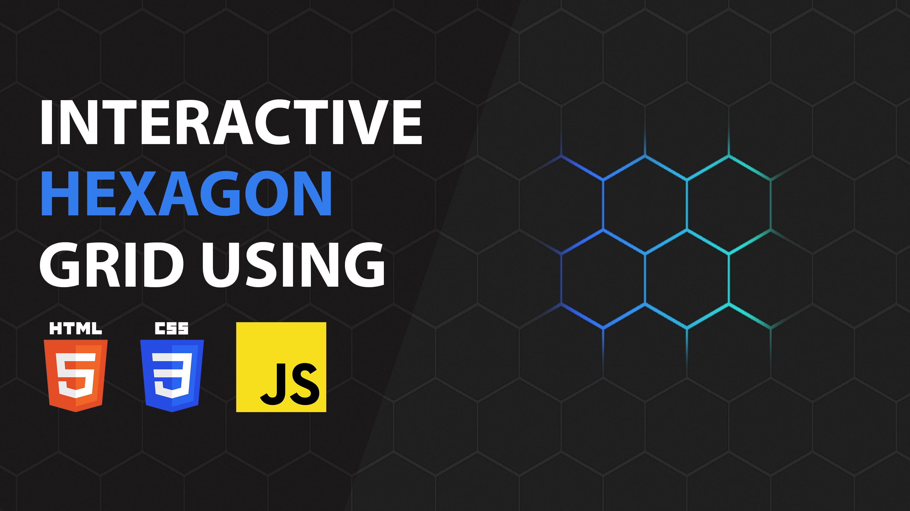

# Interactive Hexagon Grid using HTML CSS JavaScript | JavaScript Effects

The Interactive Hexagon Grid, crafted with HTML, CSS, and JavaScript, features a captivating dynamic where a light source moves in response to mouse movements behind the hexagonal grid. As the user interacts, the light source dynamically influences the appearance of the hexagons, creating an immersive visual effect. This interactive grid is not only visually engaging but also responsive to user input, offering a modern and interactive element for diverse applications, from creative displays to dynamic data visualizations. The combination of HTML, CSS, and JavaScript enables the seamless integration of this visually appealing and interactive feature into web applications.

Youtube Tutorial Link: https://youtu.be/9x6bjKpJ_ag

